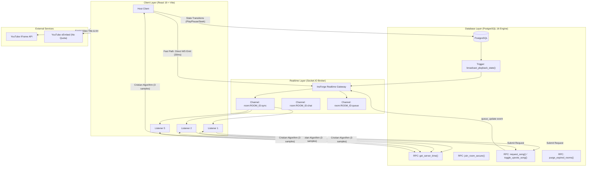

# JAM — Technical Architecture & System Design Guide
> Formerly "WiFi Jokey" (renamed 2026-09-05).

> **A synchronized, ephemeral, collaborative audio lounge platform.**  
> Built with React 19, TypeScript, Vite, InsForge (PostgreSQL + PostgREST + Realtime Socket Engine), and the YouTube IFrame API.

---

## Table of Contents

1. [Executive Summary](#1-executive-summary)
2. [Product Capabilities & Core Workflows](#2-product-capabilities--core-workflows)
3. [System Architecture Diagram](#3-system-architecture-diagram)
4. [Key Engineering Challenges & Technical Decisions](#4-key-engineering-challenges--technical-decisions)
   - [4.1 Multi-Room Realtime Isolation & Channel Scoping](#41-multi-room-realtime-isolation--channel-scoping)
   - [4.2 Sub-60ms Audio Sync: Hybrid Dual-Path Broadcasting](#42-sub-60ms-audio-sync-hybrid-dual-path-broadcasting)
   - [4.3 Asymmetric Clock Offsets: Cristian's Algorithm](#43-asymmetric-clock-offsets-cristians-algorithm)
   - [4.4 Inaudible Drift Compensation: 3-Tier Adaptive Model](#44-inaudible-drift-compensation-3-tier-adaptive-model)
   - [4.5 Atomic 5-Person Capacity & Race-Free Enforcement](#45-atomic-5-person-capacity--race-free-enforcement)
   - [4.6 Zero-Leakage Private Room Security](#46-zero-leakage-private-room-security)
   - [4.7 Zero-Quota YouTube Metadata Extraction](#47-zero-quota-youtube-metadata-extraction)
   - [4.8 Browser Autoplay Policies & Background Tab Sleep](#48-browser-autoplay-policies--background-tab-sleep)
   - [4.9 24-Hour Ephemeral Lifecycle & Cascading Deletion](#49-24-hour-ephemeral-lifecycle--cascading-deletion)
5. [Database Schema & Data Model](#5-database-schema--data-model)
6. [Directory & File Structure](#6-directory--file-structure)
7. [Developer Quickstart & Verification](#7-developer-quickstart--verification)

---

## 1. Executive Summary

**JAM** (formerly WiFi Jokey) is a modern web application designed for friends, remote teams, and study groups to listen to music synchronously together. Users can create public or private rooms, share a 6-character room code, request YouTube songs, upvote queue items in real time, chat, and listen with sub-100ms precision audio synchronization.

To maintain privacy and zero maintenance overhead, every room and all associated data (chat messages, queue items, member logs, votes) are **strictly ephemeral** and automatically self-destruct after **24 hours**.

---

## 2. Product Capabilities & Core Workflows

### 2.1 Lobby & Discovery Flow (`/`)
- **Direct Code Access**: Monospaced room code input (`ABCDEF`) for instant room navigation.
- **Public Directory**: Live directory of active public rooms displaying real-time occupancy chips (`👥 3/5`), host names, and descriptions, auto-refreshing every 15 seconds.
- **Instant Room Creation**:
  - **Public Rooms**: Open to any user up to the 5-member limit.
  - **Private Rooms**: Protected by a bcrypt-hashed password challenge.
  - Generates an unambiguous, human-readable 6-character room code (excluding easily confused glyphs like `0`, `O`, `1`, `I`).

### 2.2 In-Room Workspace (`/room/:roomCode`)
- **Security & Capacity Barrier**: Password challenge modal for private rooms; strict 5-member capacity gate preventing room overflow.
- **Synchronized Music Player**: YouTube audio engine with cover art, video toggle, scrubber, volume slider, and host playback controls.
- **Live Sync Indicator**: Visual pill next to the track metadata showing synchronization status (`🟢 Synced (24ms)`, `🟡 Catching up (1.05x)`, `🔵 Seeking`).
- **Tabbed Collaborative Sidebar**:
  - **💬 Live Chat**: Room-isolated messaging with timestamps, display names, and auto-scrolling.
  - **🎵 Collaborative Queue**: Community song requests with live thumbnails, vote counts, upvoting toggle, and host "Play Now" / dismissal controls.
- **Header Utilities**:
  - 1-click **Copy Invite Link** with toast notification.
  - Live **Occupancy Pill** with tooltip listing active listeners.
  - **24-Hour Expiry Countdown**: Displays remaining room lifespan (`⏱️ 18h 24m left`), turning amber when under 15 minutes.
  - **"← Lobby" Button**: Clean departure triggering room slot release.

---

## 3. System Architecture Diagram



---

## 4. Key Engineering Challenges & Technical Decisions

### 4.1 Multi-Room Realtime Isolation & Channel Scoping

- **The Problem**: In naive realtime setups, all clients subscribe to global channels (e.g., `'player_sync'`, `'chat_messages'`). As soon as a second room is opened, broadcasts from Room A leak into Room B, corrupting playback and mixing private chats.
- **The Decision**:
  - Registered the wildcard channel pattern `room:*` in the database realtime engine.
  - Scoped every realtime event to the room's unique UUID:
    - **Audio Sync**: `room:${roomId}:sync`
    - **Chat Messages**: `room:${roomId}:chat`
    - **Song Queue**: `room:${roomId}:queue`
  - Replaced legacy dual-publish triggers so Postgres triggers broadcast exclusively to `room:${NEW.id}:sync`.

---

### 4.2 Sub-60ms Audio Sync: Hybrid Dual-Path Broadcasting

- **The Problem**:
  - *Pure Database Trigger*: Writing every 3-second tick to Postgres via HTTP/PostgREST introduces **150–250ms of network & SQL overhead**, making tight sync impossible. It also generates 1,200 database writes per hour per active room.
  - *Pure WebSocket*: If playback state only exists in transient WebSockets, new listeners joining mid-song or users refreshing their browser have no initial state to fetch.
- **The Decision (Hybrid Architecture)**:
  1. **Fast Path (Periodic 3-second ticks)**: The host sends position updates directly via `realtime.publish('room:${roomId}:sync', 'sync', payload)` over WebSocket.
     - **Latency**: 30–60ms.
     - **Database Overhead**: **Zero database writes**.
  2. **Durable Path (State transitions only)**: When the host performs an action (play, pause, seek, load track), the client:
     - Immediately publishes over WebSocket (zero perceived lag for listeners).
     - Asynchronously updates `rooms.playback_state` in PostgreSQL so the authoritative state is permanently recorded for new joiners and reconnection fallback.

---

### 4.3 Asymmetric Clock Offsets: Cristian's Algorithm

- **The Problem**: Client device clocks vary wildly due to manual system settings, battery saver time skews, and OS differences (frequently by 200ms to several seconds). If the host stamps an event with `Date.now() = 12:00:01.000` and a listener's clock reads `12:00:00.600`, the listener calculates a false 400ms lag even when in perfect sync.
- **The Decision**:
  - Implemented **Cristian's Algorithm** in [`src/lib/clockSync.ts`](file:///C:/Users/Anuj/Desktop/Testing%20flash%203.7/wifi-jokey/src/lib/clockSync.ts).
  - Deployed a microsecond-accurate PostgreSQL RPC `get_server_time()` that returns `clock_timestamp()`.
  - On client startup, the client takes **3 round-trip samples**:
    $$\text{RTT} = t_1 - t_0$$
    $$\theta = T_{\text{server}} + \frac{\text{RTT}}{2} - t_1$$
  - Discards the highest-RTT outlier sample (network jitter) and averages the remaining offsets.
  - Both host and listeners calculate elapsed broadcast transit time against this calibrated server time:
    $$\text{expectedPosition} = \text{hostPosition} + \frac{\text{getServerNow}() - \text{state.serverTime}}{1000}$$
  - Achieves temporal alignment within **$\pm 15\text{–}35\text{ms}$**.

---

### 4.4 Inaudible Drift Compensation: 3-Tier Adaptive Model

- **The Problem**: Standard synchronization mechanisms rely on `player.seekTo(time)`. However, calling `seekTo()` forces YouTube's internal audio pipeline to flush its buffer, causing audible stutters, pops, and 500ms+ audio dropouts.
- **The Decision**: A 3-tier drift compensation model inspired by professional network audio transport:

| Tier | Absolute Drift ($|\Delta|$) | Player Action | Audio Perception |
|:---|:---|:---|:---|
| **Tier 1: In Sync** | $|\Delta| < 150\text{ms}$ | `setPlaybackRate(1.0)` | Imperceptible to human ear for music playback. No jitter. |
| **Tier 2: Micro-Rate Catch-up** | $150\text{ms} \le |\Delta| \le 800\text{ms}$ | Behind: `1.05x`<br>Ahead: `0.95x` | **Pitch-safe**: YouTube's built-in WSOLA time-stretching preserves pitch completely. Smoothly closes a 300ms gap in ~6 seconds with zero buffering. |
| **Tier 3: Hard Seek** | $|\Delta| > 800\text{ms}$ | `seekTo(expectedTime, true)` | Reserved for host scrubs, track skips, or waking up from background tabs. |

- **Defensive Device Fallback**: Restricted mobile WebViews (e.g., in-app browsers) sometimes only support rates `[0.5, 1, 2]`. On player mount, the hook queries `player.getAvailablePlaybackRates()`. If `1.05` is unsupported, it automatically falls back to a 2-tier model ($<500\text{ms}$ in-sync, $\ge 500\text{ms}$ seek) to prevent runtime exceptions.

---

### 4.5 Atomic 5-Person Capacity & Race-Free Enforcement

- **The Problem**: High-concurrency room joins can cause race conditions. If 2 users click "Join" when a room has 4 members, a naive `SELECT count(*) < 5` followed by `INSERT` will let both in, exceeding the 5-person limit.
- **The Decision**:
  - Implemented the atomic stored procedure `join_room_secure()` in PostgreSQL.
  - Uses pessimistic row locking:
    ```sql
    PERFORM 1 FROM public.rooms WHERE id = v_room.id FOR UPDATE;
    ```
  - Automatically purges expired sessions (`last_seen < now() - interval '45 seconds'`).
  - Evaluates current active member count while holding the row lock.
  - **Idempotent Session Rejoin**: If a user refreshes or temporarily drops connection, their persistent `session_id` (`localStorage` UUID) is recognized, allowing them to re-enter without false capacity blocks.
  - Heartbeat ping loop runs every 20 seconds; stale slots are freed within 45 seconds of a user closing their tab.

---

### 4.6 Zero-Leakage Private Room Security

- **The Problem**: If password hashes are stored directly in the `rooms` table, any authenticated query or PostgREST reflection could expose hashes to client browsers.
- **The Decision**:
  - Created an isolated table `room_secrets` with `REVOKE ALL` from client roles (`anon`, `authenticated`).
  - Passwords are salted and hashed using PostgreSQL `crypt(password, gen_salt('bf', 8))`.
  - Password verification is completely contained within the `join_room_secure()` RPC. The hash is **never transmitted across the network**.

---

### 4.7 Zero-Quota YouTube Metadata Extraction

- **The Problem**: The YouTube Data API v3 enforces a strict daily limit of 10,000 units. A few search calls and video lookups can exhaust this quota within minutes, breaking thumbnail and metadata display.
- **The Decision**:
  - Created [`src/lib/youtubeMetadata.ts`](file:///C:/Users/Anuj/Desktop/Testing%20flash%203.7/wifi-jokey/src/lib/youtubeMetadata.ts) using YouTube's public oEmbed endpoints:
    - Primary: `https://noembed.com/embed?url=...`
    - Fallback: `https://www.youtube.com/oembed?url=...&format=json`
  - Zero API key required, zero quota consumption, infinite reliability.
  - Video thumbnails are resolved directly via YouTube's deterministic image CDN: `https://img.youtube.com/vi/{id}/hqdefault.jpg`.

---

### 4.8 Browser Autoplay Policies & Background Tab Sleep

- **The Problem**:
  1. Modern browsers (Chrome, Safari, iOS) strictly prohibit unmuted audio playback without a direct user gesture (click/tap).
  2. Inactive background tabs throttle JavaScript `setInterval` down to once per minute, causing background listeners to drift minutes behind.
- **The Decision**:
  1. **Autoplay Unlock Queue**: When a listener joins a playing room, the audio engine attempts playback. If blocked, an error banner prompts *"Tap anywhere on the page to start the music"*, and global pointerdown/touchstart listeners unmute and resume playback seamlessly.
  2. **Visibility Lifecycle Reconciliation**: An event listener on `visibilitychange` and `window.focus` detects when a user returns to the tab, immediately triggering an authoritative DB state fetch and hard-seeking back to the host's live position.

---

### 4.9 24-Hour Ephemeral Lifecycle & Cascading Deletion

- **The Problem**: Abandoned rooms, chat logs, and queue history clutter the database, posing privacy risks and ballooning storage.
- **The Decision**:
  - Every room row includes `expires_at TIMESTAMPTZ NOT NULL DEFAULT (now() + interval '24 hours')`.
  - All dependent child tables enforce `ON DELETE CASCADE`:
    - `room_secrets.room_id REFERENCES rooms(id) ON DELETE CASCADE`
    - `room_members.room_id REFERENCES rooms(id) ON DELETE CASCADE`
    - `room_queue.room_id REFERENCES rooms(id) ON DELETE CASCADE`
    - `queue_votes.queue_id REFERENCES room_queue(id) ON DELETE CASCADE`
    - `chat_messages.room_id REFERENCES rooms(id) ON DELETE CASCADE`
  - Automated RPC `purge_expired_rooms()` runs during lobby visits:
    ```sql
    DELETE FROM public.rooms WHERE expires_at <= now();
    ```
  - A single row deletion automatically purges all room traces in one atomic transaction.

---

## 5. Database Schema & Data Model

```
                                 ┌───────────────────────┐
                                 │     public.rooms      │
                                 ├───────────────────────┤
                                 │ id: UUID (PK)         │
                                 │ name: TEXT            │
                                 │ code: VARCHAR(8) (UQ) │
                                 │ host_id: UUID (FK)    │
                                 │ is_private: BOOLEAN   │
                                 │ max_members: INT (5)  │
                                 │ playback_state: JSONB │
                                 │ expires_at: TIMESTAMPTZ│
                                 └──────────┬────────────┘
                                            │
           ┌────────────────┬───────────────┼───────────────┬────────────────┐
           │ 1:1            │ 1:N           │ 1:N           │ 1:N            │ 1:N
           ▼                ▼               ▼               ▼                ▼
┌────────────────────┐ ┌──────────────┐ ┌──────────────┐ ┌──────────────┐ ┌──────────────┐
│ public.room_secrets│ │ room_members │ │  room_queue  │ │chat_messages │ │song_requests │
├────────────────────┤ ├──────────────┤ ├──────────────┤ ├──────────────┤ ├──────────────┤
│ room_id (PK, FK)   │ │ id: UUID     │ │ id: UUID     │ │ id: UUID     │ │ (Legacy)     │
│ password_hash: TEXT│ │ room_id (FK) │ │ room_id (FK) │ │ room_id (FK) │ │              │
└────────────────────┘ │ session_id   │ │ video_id     │ │ user_id (FK) │ └──────────────┘
                       │ display_name │ │ title        │ │ message: TEXT│
                       │ role         │ │ vote_count   │ │ created_at   │
                       │ last_seen    │ │ status       │ └──────────────┘
                       └──────────────┘ └──────┬───────┘
                                               │ 1:N
                                               ▼
                                      ┌──────────────────┐
                                      │   queue_votes    │
                                      ├──────────────────┤
                                      │ queue_id (PK, FK)│
                                      │ session_id (PK)  │
                                      └──────────────────┘
```

### PostgreSQL Stored Procedures (RPCs)
- `create_room_secure(p_name, p_is_private, p_password, p_description)`: Generates code, hashes password, returns room payload.
- `join_room_secure(p_code, p_session_id, p_display_name, p_password)`: Atomic 5-member capacity lock & password verification.
- `ping_room_presence(p_room_id, p_session_id)`: Updates member `last_seen` timestamp.
- `leave_room(p_room_id, p_session_id)`: Immediately releases occupant slot.
- `request_song(p_room_id, p_video_id, p_title, ...)`: Submits song with 3-song session rate limit.
- `toggle_upvote_song(p_queue_id, p_session_id)`: Atomic upvote toggle and vote count updater.
- `update_queue_status(p_queue_id, p_status, p_room_id)`: Host moderation (mark playing/dismissed).
- `get_server_time()`: Returns `clock_timestamp()` for Cristian's Algorithm clock sync.
- `purge_expired_rooms()`: Deletes all rooms where `expires_at <= now()`.

---

## 6. Directory & File Structure

```
wifi-jokey/
├── migrations/                               # Database Migrations (Sequentially Applied)
│   ├── 20260818115348_init-schema.sql        # Initial schema (rooms, chat, song_requests)
│   ├── 20260821000000_secure-rls-host-auth.sql
│   ├── 20260821120000_hardening.sql
│   ├── 20260821130000_fk-indexes.sql
│   ├── 20260821180000_realtime-channels.sql
│   ├── 20260822130000_publish-lockdown.sql
│   ├── 20260823100000_playback-state.sql
│   ├── 20260824120000_host-handover.sql
│   ├── 20260903000000_multiroom-core.sql     # Phase 1: Capacity engine, room_secrets, room_members
│   ├── 20260903000001_multiroom-realtime-rls.sql # Phase 1: Wildcard channels, trigger scoping
│   ├── 20260903100000_ephemeral-and-queue.sql    # Phase 3: 24h expiry, room_queue, queue_votes
│   └── 20260903200000_clock-sync-and-indexes.sql # Phase 4: get_server_time, indexes, trigger cleanup
├── scripts/                                  # Automated Integration Test Suites
│   ├── test-multiroom-rpc.mjs                # Phase 1: 5-member cap, rejoin, slot recovery
│   ├── test-private-room.mjs                 # Phase 1: Zero-leakage password challenge
│   ├── test-phase3-queue.mjs                 # Phase 3: Rate limiting, upvoting, purge function
│   └── test-phase4-sync.mjs                  # Phase 4: Clock calibration, NOT NULL check, channel regex
├── src/
│   ├── components/                           # Modular UI Components
│   │   ├── AuthModal.tsx                     # Reusable email/password auth modal
│   │   ├── CreateRoomModal.tsx               # Room creator (public/private toggle)
│   │   ├── PasswordPromptModal.tsx           # Private room password barrier
│   │   ├── RequestSongModal.tsx              # Song requester with live oEmbed preview
│   │   ├── RoomCard.tsx                      # Lobby room card with live capacity badge
│   │   ├── RoomHeader.tsx                    # Room navigation, expiry timer, invite link
│   │   ├── SongQueuePanel.tsx                # Collaborative queue with upvoting & host controls
│   │   └── YouTubePlayer.tsx                 # IFrame player wrapper
│   ├── hooks/                                # React Business Logic Hooks
│   │   ├── useAuth.ts                        # InsForge user authentication
│   │   ├── useChatMessages.ts                # Room-scoped real-time chat hook
│   │   ├── useRoomQueue.ts                   # Collaborative queue & upvoting hook
│   │   └── useYouTubeMusic.ts                # Precision 3-tier sync & playback controller
│   ├── lib/                                  # Utilities & System Services
│   │   ├── clockSync.ts                      # Cristian's Algorithm clock sync service
│   │   ├── insforge.ts                       # InsForge SDK client initialization
│   │   ├── realtime.ts                       # Socket.IO client broker with reconnect logic
│   │   ├── session.ts                        # Persistent browser session & display name manager
│   │   └── youtubeMetadata.ts                # Zero-quota oEmbed metadata resolver
│   ├── pages/                                # Route Pages
│   │   ├── LobbyPage.tsx                     # Route '/' — Room discovery and creator
│   │   └── RoomPage.tsx                      # Route '/room/:roomCode' — Active room workspace
│   ├── App.css                               # Impeccable Design styles & animations
│   └── main.tsx                              # React Router v7 root entry point
├── ARCHITECTURE.md                           # This authoritative architecture document
├── package.json                              # Project dependencies & scripts
└── vite.config.ts                            # Vite configuration
```

---

## 7. Developer Quickstart & Verification

### 7.1 Prerequisites
- Node.js 18+
- InsForge CLI (`npm i -g @insforge/cli`)

### 7.2 Setup Environment
Ensure `.env` contains valid InsForge credentials:
```bash
VITE_INSFORGE_URL=https://<project-id>.insforge.app
VITE_INSFORGE_ANON_KEY=ik_<your-anon-key>
```

### 7.3 Database Migrations
Deploy all 12 database migrations:
```bash
insforge -y db migrations up --all
```

### 7.4 Running Automated Test Suites
Run the end-to-end integration tests:
```bash
# Verify Phase 1 Capacity & Session Continuity
node scripts/test-multiroom-rpc.mjs

# Verify Phase 3 Collaborative Queue & Expiry
node scripts/test-phase3-queue.mjs

# Verify Phase 4 Precision Clock Sync & Channel Scoping
node scripts/test-phase4-sync.mjs
```

### 7.5 Production Build
```bash
npm run build
```
Builds the production bundle using Vite and TypeScript strict mode, outputting to `dist/`.
